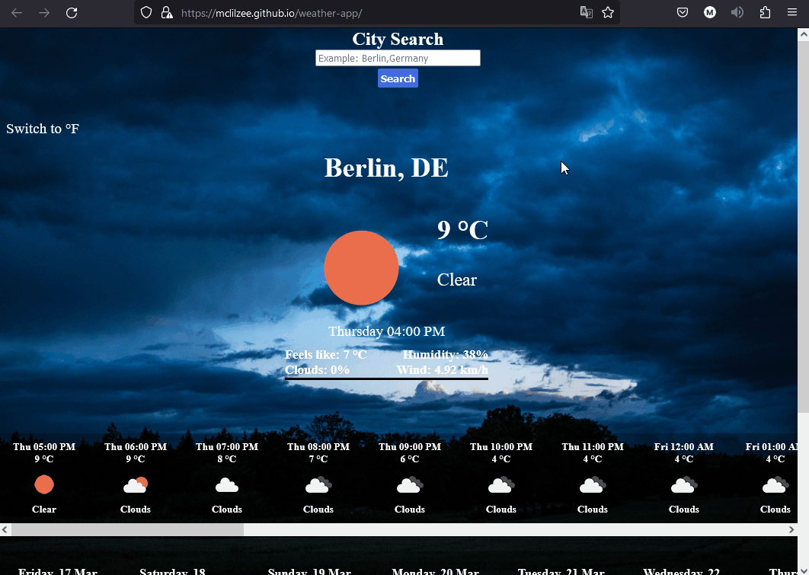
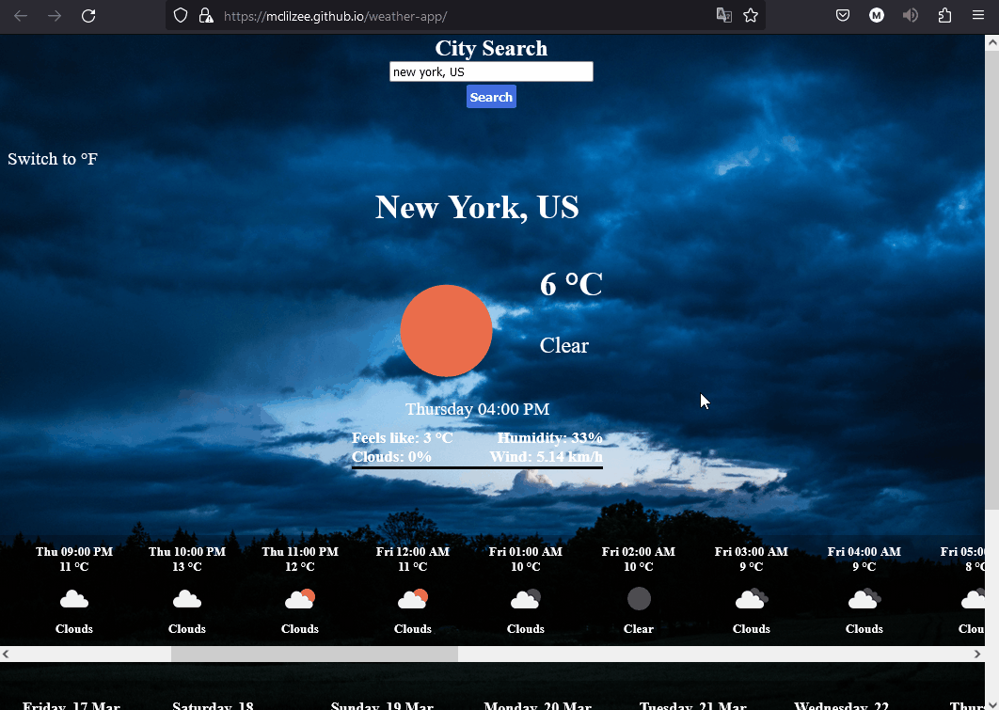

# <a href="https://mclilzee.github.io/weather-app/">Weather App</a>
A Simple weather website that will show you the weather in your desired location.
The location you chose last will be saved in your browser's local storage, so that you don't have to look it up again everytime.

The weather application have two modes, to show weather in `Celsius` Or `Fahrenheit`

# Example

### Checking Weather In New-York

### Switching Mode

# Credit

### Background Image
<a href="https://unsplash.com/@wizardwork?utm_source=unsplash&utm_medium=referral&utm_content=creditCopyText">Egidijus Bielskis</a> on <a href="https://unsplash.com/?utm_source=unsplash&utm_medium=referral&utm_content=creditCopyText">Unsplash</a>
